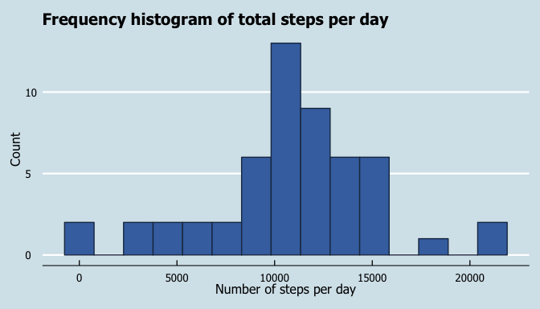

## Loading and preprocessing the data
First we start by loading the library needed and the data :


```r
library(dplyr)
```

```
## 
## Attaching package: 'dplyr'
```

```
## The following objects are masked from 'package:stats':
## 
##     filter, lag
```

```
## The following objects are masked from 'package:base':
## 
##     intersect, setdiff, setequal, union
```

```r
library(ggplot2)
library(ggthemes)
library(magrittr)
activity<-read.csv('activity.csv',header=TRUE)
```

We'll also transform the date :


```r
activity<- activity %>%
           transform(date=as.Date(date,'%Y-%m-%d'))
```


## What is mean total number of steps taken per day?

We start by looking at how many steps are taken each day :


```r
Sum_step<-activity %>%
              group_by(date) %>%
              summarize(sum_step=sum(steps))
```
We choose to keep the *NA* values to avoid an increase of the occurency "0 steps taken" in a day.
Let's have a look at the histogram of total steps taken per days :


```r
Sum_step%>%
  ggplot(aes(x = sum_step))+
  geom_histogram(bins=15,color='#1F3552',fill='#4271AE')+
  scale_x_continuous(name = "Number of steps per day")+
  scale_y_continuous(name = "Count") +
  ggtitle("Frequency histogram of total steps per day") +
  theme_economist() +
  theme(legend.position = "bottom", legend.direction = "horizontal",
        legend.box = "horizontal",
        legend.key.size = unit(1, "cm"),
        plot.title = element_text(family="Tahoma"),
        text = element_text(family = "Tahoma"),
        axis.title = element_text(size = 12),
        legend.text = element_text(size = 9),
        legend.title=element_text(face = "bold", size = 9))
```

```
## Warning: Removed 8 rows containing non-finite values (stat_bin).
```

<!-- -->

Let's know have a look at the mean and median :


```r
meanStep<-mean(Sum_step$sum_step,na.rm=TRUE)
medianStep<-median(Sum_step$sum_step,na.rm = TRUE)
```

The mean is equal to 1.0766189\times 10^{4} and the median is equal to 10765.

## What is the average daily activity pattern?

Let's have a look at the Average Steps taken per interval during the total period :


```r
avg_step<- activity %>%
  group_by(interval) %>%
  summarize(avg_step=mean(steps,na.rm = TRUE))

avg_step %>%
  ggplot(aes(x=interval,y=avg_step))+
  geom_line(color='dodgerblue')+
  scale_x_continuous(name = "Interval")+
  scale_y_continuous(name = "Average steps") +
  ggtitle("Average steps taken per interval") +
  theme_economist() +
  theme(legend.position = "bottom", legend.direction = "horizontal",
        legend.box = "horizontal",
        legend.key.size = unit(1, "cm"),
        plot.title = element_text(family="Tahoma"),
        text = element_text(family = "Tahoma"),
        axis.title = element_text(size = 12),
        legend.text = element_text(size = 9),
        legend.title=element_text(face = "bold", size = 9))
```

<!-- -->

We want to look at the 5-min interval that contains the maximum number of steps :


```r
maxInt<-avg_step %>%
  filter(avg_step==max(avg_step)) %>%
  select(interval)%>%
  extract2(1)
```

The 5-min interval is the 835 interval.


## Imputing missing values

Let's calculate how many missing data we have in the dataset :


```r
sum(is.na(activity))
```

```
## [1] 2304
```

We'll replace NA values with the mean of the interval :


```r
NArow<-which(is.na(activity$steps))
act_NA<-activity

for (i in NArow){
  
  act_NA[i,1]<-avg_step$avg_step[which(avg_step$interval==act_NA[i,3])]
  
}  
```

Let's have a look at the first histogram with the imputed value for NA :


```r
Sum_step_na<-act_NA %>%
              group_by(date) %>%
              summarize(sum_step=sum(steps))
Sum_step_na%>%
  ggplot(aes(x = sum_step))+
  geom_histogram(bins=15,color='#1F3552',fill='#4271AE')+
  scale_x_continuous(name = "Number of steps per day")+
  scale_y_continuous(name = "Count") +
  ggtitle("Frequency histogram of total steps per day") +
  theme_economist() +
  theme(legend.position = "bottom", legend.direction = "horizontal",
        legend.box = "horizontal",
        legend.key.size = unit(1, "cm"),
        plot.title = element_text(family="Tahoma"),
        text = element_text(family = "Tahoma"),
        axis.title = element_text(size = 12),
        legend.text = element_text(size = 9),
        legend.title=element_text(face = "bold", size = 9))
```

<!-- -->

```r
mean(Sum_step_na$sum_step)
```

```
## [1] 10766.19
```

```r
median(Sum_step_na$sum_step)
```

```
## [1] 10766.19
```

The fact that we are taking the mean of each interval to replace the NA value only reinforce the trend already present when excluding NA's value at first.

## Are there differences in activity patterns between weekdays and weekends?


```r
weekend<-c('Samedi','Dimanche')
act_NA$day<-weekdays(act_NA$date)
act_NA$week<-NA
act_NA$week[-which(act_NA$day %in% weekend)]<-'weekday'
act_NA$week[which(act_NA$day %in% weekend)]<-'weekend'
```

Let's see if we see any difference in activity pattern between weekday and weekend :


```r
act_NA %>%
  group_by(week,interval) %>%
  summarize(avg_step=mean(steps)) %>%
  ggplot(aes(x=interval,y=avg_step))+
  geom_line(color='dodgerblue')+
  facet_wrap(week~.)+
  scale_x_continuous(name = "Interval")+
  scale_y_continuous(name = "Average steps") +
  ggtitle("Average steps taken per interval") +
  theme(legend.position = "bottom", legend.direction = "horizontal",
        legend.box = "horizontal",
        legend.key.size = unit(1, "cm"),
        plot.title = element_text(family="Tahoma"),
        text = element_text(family = "Tahoma"),
        axis.title = element_text(size = 12),
        legend.text = element_text(size = 9),
        legend.title=element_text(face = "bold", size = 9))
```

<!-- -->
